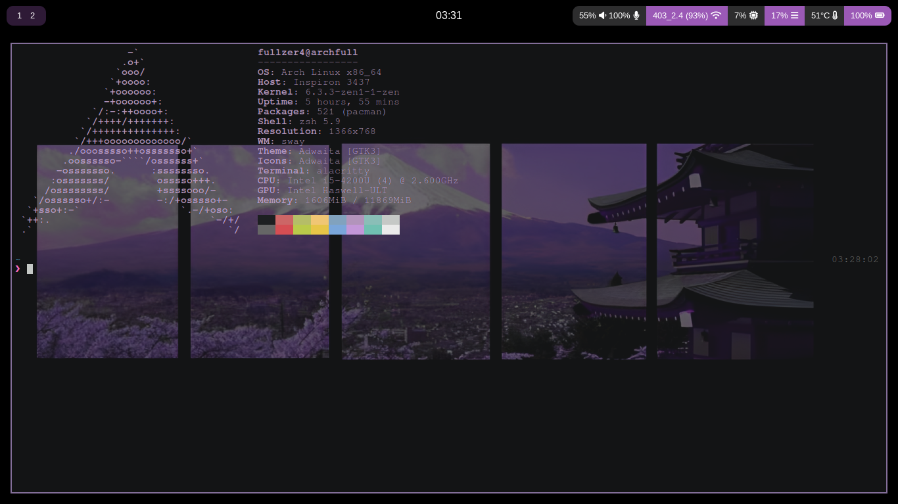

# dotFiles_ArchSway

My arch Linux setup Interface, files and others :)



## Incial setup

1 - Make a flash pendrive with arch-iso file ( recommended to use: rufus / balena-etcher )
2 - After doing the bootable pendrive for the arch instalattion lets use the archinstall command to simplify your lifes

### Desktop:

if you are in a desktop enviromment with cable network you dont need to setup wifi etc... just skip to the next step

### Notebook:

To setup our network we need to do this steps

```bash
  iwctl 
```

```bash
  device list
```

Replace wlan0 and WifiNetwork for your parameters

```bash
  station wlan0 connect WifiNetwork
```
Then after connectiong just exit

```bash
  exit
```

3 - after connecting to a network we are going to install your arch linux with archinstall

```bash
  archinstall
```

### In the options i prefer to use this settings for my enviromment:

In 'Drivers': is use ext4 format without /home partition

In 'Swap': False

In 'Root password': None

In 'Profile':

- desktop

- sway

- polkit

- ( chose your device )

In 'Kernels': linux-zen

In 'Additional packages': firefox git

In 'Network configuration': Use NetworkManager

In 'Optional repositories': multilib
